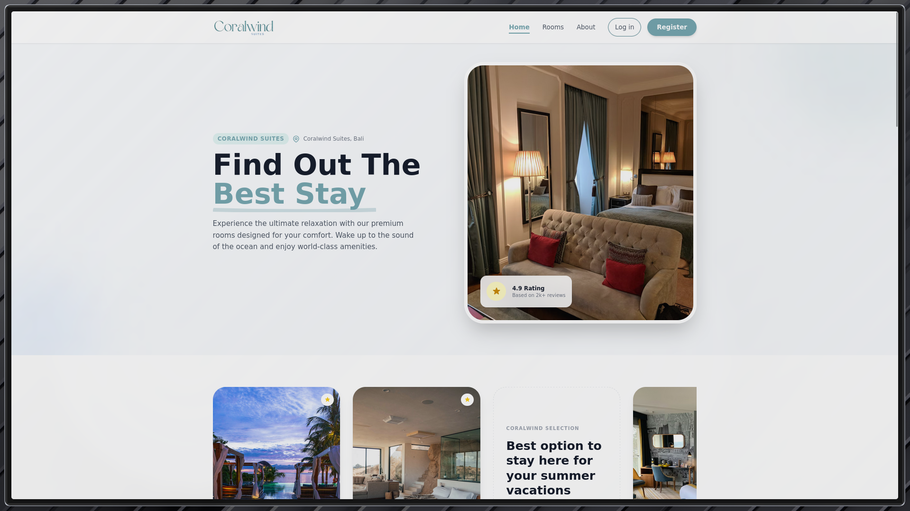

# 🏨 Coralwind Suites Hotel - Booking System



Sistem booking hotel modern yang dibangun dengan Laravel dan Livewire. Coralwind Suites menawarkan pengalaman pemesanan kamar hotel yang seamless dengan berbagai fitur unggulan untuk meningkatkan kepuasan pelanggan.

## ✨ Fitur Unggulan

### 🎯 Sistem Booking Cerdas

-   **Real-time Availability Check** - Sistem otomatis mengecek ketersediaan kamar berdasarkan tanggal check-in dan check-out
-   **Smart Date Picker** - Tanggal yang sudah dibooking otomatis di-disable untuk mencegah double booking
-   **Dynamic Price Calculation** - Harga otomatis dihitung berdasarkan durasi menginap dan diskon yang tersedia
-   **Multiple Payment Methods** - Mendukung pembayaran di hotel (Pay at Hotel) dan Credit Card

### 💳 Manajemen Pembayaran Fleksibel

-   **Auto Status Update** - Status booking otomatis berubah menjadi "Paid" untuk pembayaran Credit Card
-   **Refund System** - Pembatalan booking berbayar dengan informasi pengembalian dana dalam 15 menit
-   **Secure Card Processing** - Nomor kartu kredit dienkripsi di database untuk keamanan maksimal

### 🎁 Sistem Diskon & Kupon

-   **Dynamic Discount System** - Kupon diskon dapat diklaim dan digunakan saat booking
-   **Coupon Code Redemption** - User dapat memasukkan kode kupon untuk mendapatkan diskon
-   **Auto-apply Discount** - Diskon otomatis diterapkan pada total harga
-   **One-time Use** - Setiap kupon hanya dapat digunakan sekali per user

### 👤 Profil User Otomatis

-   **Auto-save NIK & Phone** - NIK dan nomor telepon otomatis tersimpan di profil user
-   **Auto-fill Forms** - Data user otomatis terisi pada booking berikutnya
-   **Smart Update** - Sistem otomatis update profil jika user mengubah data

### 📊 Riwayat Transaksi Lengkap

-   **Booking History** - Lihat semua riwayat booking dengan status yang jelas
-   **Invoice Download** - Download invoice dengan QR Code untuk verifikasi
-   **QR Code Verification** - Admin dapat scan QR Code untuk verifikasi booking
-   **Status Tracking** - Track status booking: Pending, Paid, Completed, Cancelled

### ⭐ Sistem Review & Rating

-   **Write Reviews** - User dapat menulis review setelah booking selesai
-   **10-Star Rating** - Sistem rating 1-10 bintang untuk penilaian yang lebih detail
-   **Edit & Delete** - User dapat edit atau hapus review mereka
-   **Real-time Rating** - Rating kamar otomatis terupdate berdasarkan review

### 🎨 User Experience Premium

-   **Modern UI/UX** - Desain modern dengan Tailwind CSS dan animasi smooth
-   **Error Handling** - Validasi form dengan pesan error yang jelas
-   **Form Retention** - Data form tetap tersimpan jika terjadi error validasi
-   **Success Messages** - Notifikasi sukses yang informatif
-   **Responsive Design** - Tampilan optimal di semua device

### 🔐 Admin Panel (Filament)

-   **Room Management** - Kelola kamar hotel dengan mudah
-   **Booking Management** - Monitor dan kelola semua booking
-   **User Management** - Kelola user dan role
-   **Discount Management** - Buat dan kelola kupon diskon
-   **Review Moderation** - Monitor dan moderasi review user

## 🛠️ Tech Stack

-   **Framework**: Laravel 11
-   **Frontend**: Livewire 3, Tailwind CSS, Alpine.js
-   **Admin Panel**: Filament 3
-   **Database**: MySQL
-   **Date Picker**: Flatpickr
-   **Icons**: Heroicons

## 📋 Prerequisites

-   PHP >= 8.2
-   Composer
-   Node.js & NPM
-   MySQL

## 🚀 Installation

1. Clone repository

```bash
git clone <repository-url>
cd app-melvin
```

2. Install dependencies

```bash
composer install
npm install
```

3. Setup environment

```bash
cp .env.example .env
php artisan key:generate
```

4. Configure database di `.env`

```env
DB_CONNECTION=mysql
DB_HOST=127.0.0.1
DB_PORT=3306
DB_DATABASE=coralwind_db
DB_USERNAME=root
DB_PASSWORD=
```

5. Run migrations & seeders

```bash
php artisan migrate:fresh --seed
```

6. Build assets

```bash
npm run build
```

7. Start development server

```bash
php artisan serve
```

## 👥 Default Accounts

### Admin

-   Email: `admin@coralwind.com`
-   Password: `password`

### User

-   Email: `user@example.com`
-   Password: `password`

## 📱 Fitur-Fitur Utama

### Untuk Customer

1. **Browse Rooms** - Lihat katalog kamar dengan filter berdasarkan tipe
2. **Check Availability** - Cek ketersediaan kamar real-time
3. **Book Room** - Booking kamar dengan form yang user-friendly
4. **Apply Discount** - Gunakan kupon diskon saat booking
5. **Payment Options** - Pilih metode pembayaran yang sesuai
6. **Download Invoice** - Download invoice dengan QR Code
7. **Write Review** - Berikan review setelah menginap
8. **Cancel Booking** - Batalkan booking dengan refund otomatis (untuk paid bookings)

### Untuk Admin

1. **Dashboard** - Overview statistik hotel
2. **Manage Rooms** - CRUD kamar hotel
3. **Manage Bookings** - Monitor semua booking
4. **Verify Bookings** - Scan QR Code untuk verifikasi
5. **Manage Discounts** - Buat dan kelola kupon diskon
6. **View Reviews** - Monitor review dari customer

## 🎯 Inovasi Unggulan

1. **Smart Booking Prevention** - Sistem mencegah double booking dengan validasi tanggal yang canggih
2. **Auto Profile Management** - NIK dan nomor HP otomatis tersimpan dan terisi di booking berikutnya
3. **Dynamic Discount System** - Kupon dapat diklaim dan digunakan dengan sistem one-time use
4. **QR Code Verification** - Verifikasi booking menggunakan QR Code yang aman
5. **Refund Information** - Informasi pengembalian dana yang jelas untuk pembatalan booking berbayar
6. **Form Retention** - Data form tidak hilang saat terjadi error validasi
7. **Encrypted Card Data** - Nomor kartu kredit dienkripsi untuk keamanan maksimal

## 📞 Contact

Untuk pertanyaan atau bantuan, hubungi:

-   Phone: (021) 123-4567
-   Email: info@coralwindsuites.com
-   Address: Jl. Pantai Indah No. 88, Bali

## 📄 License

This project is proprietary software.

---

**Coralwind Suites Hotel** - Wake up to the sound of the ocean 🌊
